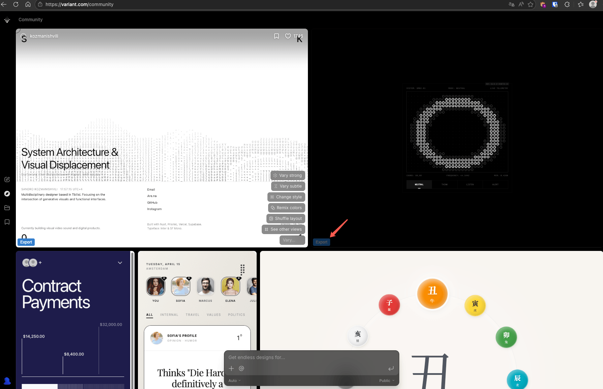

# Variant Export

[GreasyFork](https://greasyfork.org/zh-CN/scripts/571941-variant-export)

Variant is really great to use, and I’d be happy to pay for it.
But when I recommended it to a friend, I found out that you can’t export anything without a paid subscription.
I’m not sure when this policy was changed, but it’s really not a good move.
To give a simple example: if my membership expires, will I still be able to export what I’ve generated before?

I don’t want to hand over control to Variant, so I spent 3 minutes writing this script—it’s so simple I didn’t even need AI.

Its function is straightforward: it adds an export button in the bottom-left corner of the generated UI. Clicking it will export the content as an HTML file.

----------------------

variant 非常好用, 我也很乐意为其付费, 但是我将其推荐给朋友时发现没有付费居然不允许导出? 我不知道这是什么时候修改的政策, 但这很不好, 举个简单的例子, 如果我的会员到期了我还能导出之前生成的吗?

我不打算把控制权交到variant手上, 于是我话3分钟写出了这个脚本(简单到都不需要AI

它的作用非常简单, 在生成的UI左下角添加一个导出按钮, 点击后即可导出为HTML文件
